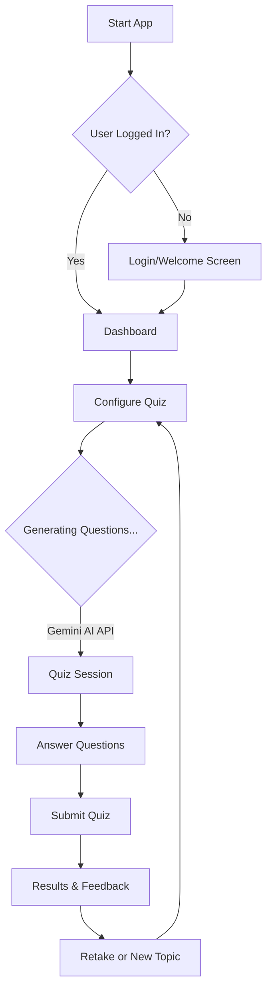

# Interview Prep AI 🤖

Master your technical interviews with personalized, AI-generated quizzes! 🚀

## Overview

Interview Prep AI is a modern React application powered by Google's Gemini AI. It creates unique interview questions tailored to specific topics, difficulties, and even target companies. Whether you're preparing for a frontend role at a startup or a full-stack position at a tech giant, this tool helps you refine your skills with relevant practice.

## Features 🌟

- **AI-Powered Questions 🧠:** Leverages Google Generative AI (Gemini) to generate high-quality, context-aware multiple-choice questions.
- **Customizable Quizzes ✨:** Choose your topic (e.g., React, Python, System Design), difficulty level, and specify a target company for specialized practice.
- **Interactive UI 🎨:** A sleek, dark-themed interface with glassmorphism effects and smooth transitions for a premium user experience.
- **Real-time Feedback ⚡:** Get instant results and explanations for each question to learn as you go.
- **Performance Tracking 📊:** Review your score and see a breakdown of your answers at the end of each session.

## Application Flow 🔄

Here is the high-level flow of the application:



## Tech Stack 💻

- **Frontend:** [React](https://react.dev/) + [Vite](https://vitejs.dev/)
- **Styling:** CSS3 (Variables, Flexbox/Grid, Glassmorphism)
- **AI Integration:** [Google Generative AI SDK](https://www.npmjs.com/package/@google/generative-ai)
- **State Management:** React Context API (`QuizContext`, `AuthContext`)

## Installation 🛠️

Follow these steps to set up the project locally:

1.  **Clone the repository:**
    ```bash
    git clone https://github.com/your-username/interview-prep-ai.git
    cd interview-prep-ai
    ```

2.  **Install dependencies:**
    ```bash
    npm install
    ```

3.  **Environment Setup (Optional):**
    The application uses a Google Gemini API key. While a default key might be included for demo purposes, it's recommended to use your own.
    Create a `.env` file in the root directory:
    ```env
    VITE_GEMINI_API_KEY=your_api_key_here
    ```

4.  **Run the development server:**
    ```bash
    npm run dev
    ```

5.  **Open in Browser:**
    Navigate to `http://localhost:5173` to see the app in action!

## Project Structure BW

```
src/
├── components/        # UI Components (Screens, Buttons, etc.)
│   ├── WelcomeScreen.jsx
│   ├── QuestionScreen.jsx
│   └── ResultsScreen.jsx
├── services/          # External services (API calls)
│   ├── ai.js
│   └── gemini.js      # Gemini AI integration logic
├── store/             # Context Providers
│   ├── auth-context.jsx
│   └── quiz-context.jsx
├── App.jsx            # Main application component
└── main.jsx           # Entry point
```

## Contributing 🤝

Contributions are welcome! Please feel free to submit a Pull Request.

1. Fork the project
2. Create your Feature Branch (`git checkout -b feature/AmazingFeature`)
3. Commit your Changes (`git commit -m 'Add some AmazingFeature'`)
4. Push to the Branch (`git push origin feature/AmazingFeature`)
5. Open a Pull Request

## License 📄

Distributed under the MIT License. See `LICENSE` for more information.
